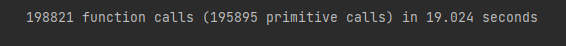

Filter  
filter.py время исполнения больше, потому что тратится много времени на ввод данных

old_filter.py время испoления значительно ниже, потому что нет ввода данных вручную  

filter_with_filename.py время исполнения значительно уменьшилось после исключения человеческого фактора во время работы программы, но время всё равно увеличилось по сравнению с old_filter.py  

Doctests на метод get_grayscale  

